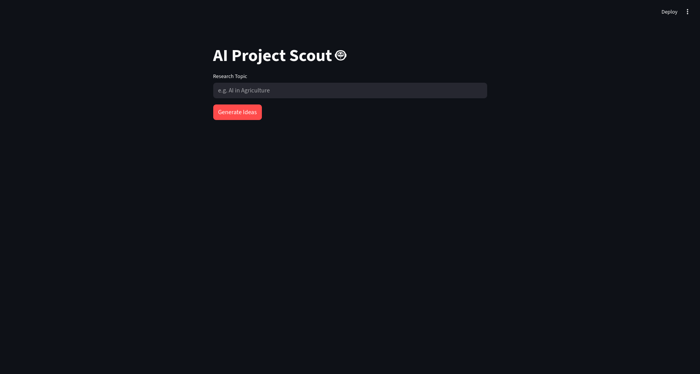

# AI Project Scout


An intelligent research agent that scouts the internet for innovative AI project ideas based on your specific topic. Built with **n8n**, **Groq (Llama 3)**, and **Streamlit**.



## Features

* **Autonomous Research:** Uses an AI Agent (Llama 3) to understand context and refine search queries.
* **Real-time Web Search:** Integrates with **Tavily API** to fetch up-to-date information from the web, not just training data.
* **Minimalist Interface:** A clean, distraction-free Streamlit UI for generating and downloading reports.
* **Downloadable Reports:** Export your research findings directly to a Markdown file.

## Tech Stack

* **Workflow Automation:** [n8n](https://n8n.io/)
* **LLM Engine:** [Groq](https://groq.com/) (Llama 3.1 8b)
* **Search Tool:** [Tavily AI](https://tavily.com/)
* **Frontend:** [Streamlit](https://streamlit.io/) (Python)

## Project Structure

```bash
project-ideas-agent/
├── workflows/
│   └── AI_Research_Agent.json   # Import this into n8n
├── assets/
│   └── demo_screenshot.png      # UI Preview
├── app.py                       # Streamlit Application
├── requirements.txt             # Python Dependencies
└── README.md                    # Documentation
```

## Setup & Installation

### Prerequisites

* An n8n instance (Cloud or Self-hosted)
* API Keys for **Groq** and **Tavily**
* Python 3.8+ installed

### 1. Backend Setup (n8n)

1. Import the workflow file located in `workflows/AI_Research_Agent.json` into your n8n instance.
2. Configure your credentials:

   * **Groq:** Add your API key in the n8n credentials manager.
   * **Tavily:** Open the "Tavily Search Tool" node and paste your API key in the JSON parameter.
3. Activate the workflow and copy the **Production Webhook URL**.

### 2. Frontend Setup (Streamlit)

Clone the repository and install dependencies:

```bash
git clone https://github.com/AadityaSNambiar/project-ideas-agent.git
cd project-ideas-agent
pip install -r requirements.txt
```

Open `app.py` and replace the `WEBHOOK_URL` with your actual n8n Webhook URL:

```python
# app.py
WEBHOOK_URL = "https://your-n8n-instance.com/webhook/..."
```

Run the application:

```bash
streamlit run app.py
```

## Contributing

Contributions are welcome! Please fork the repository and submit a pull request for any improvements.

## License

This project is open source and available under the [MIT License](LICENSE).
